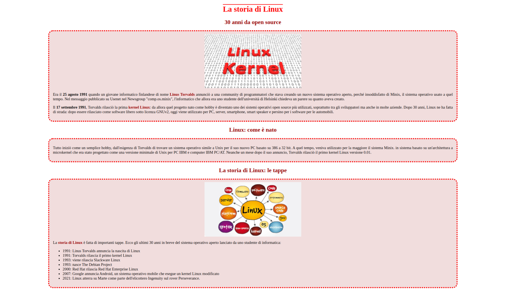

# Laboratorio 2: stile

## Descrizione del laboratorio
Gli obiettivi di questo primo laboratorio sono quelli di:

- inserire gli elementi di messa in forma (stile) all'interno del foglio di stile `style.css`
- utilizzare i selettori css
    - `element selectors`
    - `id selectors`
    - `class selectors` 
- utilizzare contenitori `<div>`

## Esempio di `element selector`
Per modificare il colore di tutti le sezioni `h1`

```
h1 {
    color: rgb(255,0,0);
}
```
## Esempio di `class selector` con un contenitore `div>

Se vogliamo gestire lo stile di tutta la prima sezione `30 anni di open source` che contiene un'immagine e due paragrafi andiamo ad inserire il tutto in un contenitore `<div class="block"> contenuto </div>` definendo un attributo `class="block"` da poter utilizzare nella definizione dello stile

`index.html`
```
<div class="block">


<p>
Era il 25 agosto 1991 quando un giovane informatico  ...
...
... server, smartphone, smart speaker e persino per i software per le automobili.
</p>
</div>

```

`style.css`
```
.block {
    background-color:  rgb(241,221,221);
}
```

## Risultato atteso

